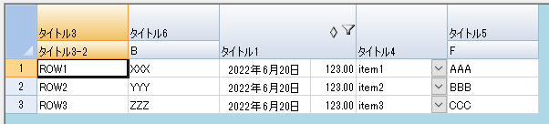

# サポートするjsonレイアウト
ColumnHeader, Columns セクションにて構成されます。
サポートされるセクション名、要素名は下記の通りとなります。

```json
{
  // 必須
  "ColumnHeader": {
    // 必須
    "Rows": [
      {
        // 任意
        "Height": 40,
        // 任意
        "HorizontalAlignment": "Left",
        // 任意
        "VerticalAlignment": "Bottom",
        // 必須
        "Columns": [
          {
            // 任意
            "Value": "タイトル3",
            // 任意
            "HorizontalAlignment": "Left",
            // 任意
            "VerticalAlignment": "Bottom"
          }
          // ... ヘッダーの列の数分、複数指定
        ]
      }
      // ... ヘッダーの行の数分、複数指定
    ],
    // 任意
    "Spans": [
      {
        // 必須
        "Row": 0, // 結合を開始する行のインデックス
        // 必須
        "Column": 2, // 結合を開始する列のインデックス
        // 必須
        "RowCount": 2, // 結合を行う行数
        // 必須
        "ColumnCount": 2 // 結合を行う列数
      }
      // ヘッダーのセル結合の数分、複数指定
    ]
  },
  // 任意
  // 列全体の設定
  "AllColumn": {
    // 任意
    "HorizontalAlignment": "Left",
    // 任意
    "VerticalAlignment": "Bottom",
    // 任意
    "AllowAutoFilter": false,
    // 任意
    "AllowAutoSort": false,
    // 任意
    "Width": 100,
    // 任意
    "Visible": true,
    // 任意
    "ImeMode": "On",
    // 任意
    "Locked": false,
  },
  // 必須  BindJsonLayoutWithoutColumns() による実行の場合は不要
  "Columns": [
    {
      // 任意
      "DataField": "Column3",
      // 任意
      "HorizontalAlignment": "Left",
      // 任意
      "VerticalAlignment": "Bottom",
      // 任意
      "AllowAutoFilter": false,
      // 任意
      "AllowAutoSort": false,
      // 任意
      "Width": 100,
      // 任意
      "Visible": true,
      // 必須
      "CellType": "TextCellType",
      // 任意
      "CellTypeProperties": {
        // 任意
        "MaxLength": 255,
        // 任意
        "CharacterCasing": "Upper",
        // 任意
        "CharacterSet": "AllIME",
        // 任意
        "Multiline": false,
        // 任意
        "ReadOnly": false,
        // 任意
        "Static": false
      },
      // 任意
      "ImeMode": "On",
      // 任意
      "Locked": false,
      // 任意
      "Options": {
        "UseFreeWords": false,
        "ExtendWordsEnabled": false
      }
    }
    // 列の数分、複数指定
  ]
}
```

# マッピングされるプロパティ
基本的に、指定された名称のプロパティへ値がマッピングされます。  
HorizontalAlignment, VerticalAlignment のように、Enum値となるプロパティはEnumの値または名称を値として設定します。  
(DateTimeCellType の Calendar のみ指定方法が異なります。)

ColumnHeader セクションは、SheetView.ColumnHeader に影響を及ぼします。  
  
Columns セクションの、CellType は、下記のみサポートします。
  - ButtonCellType
  - CheckBoxCellType
  - ComboBoxCellType
  - DateTimeCellType
  - GcComboBoxCellType
  - GcDateTimeCellType
  - GcNumberCellType
  - GcTextBoxCellType
  - NumberCellType
  - RegularExpressionCellType
  - TextCellType

Columns セクションの、CellTypeProperties は CellType によってサポートされるプロパティが異なります。

ButonCellType の場合
  - Text
  - TextDown
  - TextAlign
  - TwoState
  - WordWrap

CheckBoxCellType の場合
  - TextTrue
  - TextFalse
  - TextIndeterminate
  - ThreeState

ComboBoxCellType の場合
  - MaxDrop
  - Editable
  - EditorValue

DateTimeCellType の場合
  - Calendar ("GregorianLocalized", "GregorianUS", "Japanese" をサポート)
  - DateTimeFormat
  - EnableSubEditor
  - MaximumDate
  - MaximumTime
  - MinumumDate
  - MinumumTime
  - ReadOnly
  - Static

NumberCellType の場合
  - DecimalPlaces
  - DecimalSeparator
  - EnableSubEditor
  - FixedPoint
  - LeadingZero
  - MaximumValue
  - MinimumValue
  - NegativeFormat
  - NegativeRed
  - ReadOnly
  - Separator
  - ShowSeparator
  - Static

TextCellType の場合
  - EnableSubEditor
  - MaxLength
  - CharacterCasing
  - CharacterSet
  - Multiline
  - ReadOnly
  - Static

Columns セクションの、Options は レイアウトには影響を及ぼしません。  
BindJsonLayout(Root, Func<SheetView, Root, IList<ColumnMoveResult>>) の呼出によって任意の操作を行うために利用することができます。

# 例
```json
{
  "ColumnHeader": {
    "Rows": [
      {
        "RowProperties": {
          "Height": 40,
          "HorizontalAlignment": "Left",
          "VerticalAlignment": "Bottom"
        },
        "Columns": [
          {
            "Value": "タイトル3",
            "HorizontalAlignment": "Left",
            "VerticalAlignment": "Bottom"
          },
          {
            "Value": "タイトル6",
            "HorizontalAlignment": "Left",
            "VerticalAlignment": "Bottom"
          },
          {
            "Value": "タイトル1",
            "HorizontalAlignment": "Right",
            "VerticalAlignment": "Top"
          },
          {
            "Value": "タイトル2",
            "HorizontalAlignment": "Center",
            "VerticalAlignment": "Bottom"
          },
          {
            "Value": "タイトル4",
            "HorizontalAlignment": "Left",
            "VerticalAlignment": "Bottom"
          },
          {
            "Value": "タイトル5",
            "HorizontalAlignment": "Left",
            "VerticalAlignment": "Bottom"
          }
        ]
      },
      {
        "RowProperties": {
          "Height": 20,
          "HorizontalAlignment": "Left",
          "VerticalAlignment": "Bottom"
        },
        "Columns": [
          {
            "Value": "タイトル3-2",
            "HorizontalAlignment": "Left",
            "VerticalAlignment": "Bottom"
          }
        ]
      }
    ],
    "Spans": [
      {
        "Row": 0,
        "Column": 2,
        "RowCount": 2,
        "ColumnCount": 2
      },
      {
        "Row": 0,
        "Column": 4,
        "RowCount": 2,
        "ColumnCount": 1
      }
    ]
  },
  "Columns": [
    {
      "DataField": "Column3",
      "HorizontalAlignment": "Left",
      "VerticalAlignment": "Bottom",
      "AllowAutoFilter": false,
      "AllowAutoSort": false,
      "Width": 100,
      "Visible": true,
      "CellType": "TextCellType",
      "CellTypeProperties": {
        "MaxLength": 255,
        "CharacterCasing": "Upper",
        "CharacterSet": "AllIME",
        "Multiline": false,
        "ReadOnly": false,
        "Static": false
      },
      "ImeMode": "On",
      "Locked": false,
      "Options": {
        "UseFreeWords": false,
        "ExtendWordsEnabled": false
      }
    },
    {
      "DataField": "Column6",
      "HorizontalAlignment": "Left",
      "VerticalAlignment": "Bottom",
      "AllowAutoFilter": false,
      "AllowAutoSort": false,
      "Width": 100,
      "Visible": true,
      "CellType": "TextCellType",
      "CellTypeProperties": {
        "MaxLength": 255,
        "CharacterCasing": "Upper",
        "CharacterSet": "AllIME",
        "Multiline": false,
        "ReadOnly": false,
        "Static": false
      },
      "ImeMode": "On",
      "Locked": false,
      "Options": {
        "UseFreeWords": false,
        "ExtendWordsEnabled": false
      }
    },
    {
      "DataField": "Column1",
      "HorizontalAlignment": "Center",
      "VerticalAlignment": "Bottom",
      "AllowAutoFilter": true,
      "AllowAutoSort": true,
      "Width": 100,
      "Visible": true,
      "CellType": "DateTimeCellType",
      "CellTypeProperties": {
        "Calendar": "GregorianLocalized",
        "DateTimeFormat": "LongDate",
        "MaximumDate": "9999/12/31",
        "MaximumTime": "23:59:59",
        "MinumumDate": "0001/01/01",
        "MinumumTime": "00:00:00",
        "ReadOnly": false,
        "Static": false
      },
      "ImeMode": "On",
      "Locked": false,
      "Options": {
        "UseFreeWords": true,
        "ExtendWordsEnabled": true
      }
    },
    {
      "DataField": "Column2",
      "HorizontalAlignment": "Right",
      "VerticalAlignment": "Bottom",
      "AllowAutoFilter": false,
      "AllowAutoSort": false,
      "Width": 50,
      "Visible": true,
      "CellType": "NumberCellType",
      "CellTypeProperties": {
        "DecimalPlaces": -1,
        "DecimalSeparator": ".",
        "FixedPoint": true,
        "LeadingZero": "Yes",
        "MaximumValue": 9999999.99,
        "MinimumValue": -9999999.99,
        "NegativeFormat": "UseRegional",
        "NegativeRed": false,
        "ReadOnly": false,
        "Separator": ",",
        "ShowSeparator": true,
        "Static": false
      },
      "ImeMode": "On",
      "Locked": false,
      "Options": {
        "UseFreeWords": true,
        "ExtendWordsEnabled": true
      }
    },
    {
      "DataField": "Column4",
      "HorizontalAlignment": "Left",
      "VerticalAlignment": "Bottom",
      "AllowAutoFilter": false,
      "AllowAutoSort": false,
      "Width": 100,
      "Visible": true,
      "CellType": "ComboBoxCellType",
      "CellTypeProperties": {
        "MaxDrop": 8
      },
      "ImeMode": "On",
      "Locked": false,
      "Options": {
        "UseFreeWords": true,
        "ExtendWordsEnabled": true
      }
    },
    {
      "DataField": "Column5",
      "HorizontalAlignment": "Left",
      "VerticalAlignment": "Bottom",
      "AllowAutoFilter": false,
      "AllowAutoSort": false,
      "Width": 100,
      "Visible": true,
      "CellType": "TextCellType",
      "CellTypeProperties": {
        "MaxLength": 255,
        "CharacterCasing": "Upper",
        "CharacterSet": "AllIME",
        "Multiline": false,
        "ReadOnly": false,
        "Static": false
      },
      "ImeMode": "On",
      "Locked": false,
      "Options": {
        "UseFreeWords": false,
        "ExtendWordsEnabled": false
      }
    }
  ]
}
```


